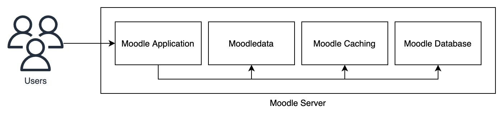
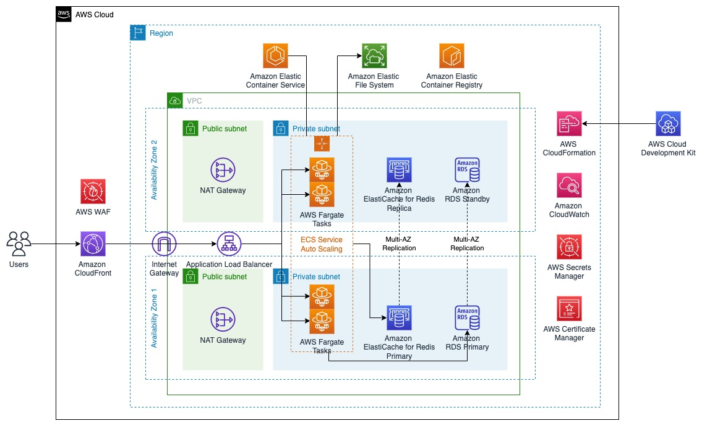

# Running Moodle LMS with AWS Serverless Containers

Moodle is a popular open source learning management system (LMS). Many education institutions are using Moodle to provide an online learning platform for their students to achieve their learning goals. It is especially critical due to the impact of Covid-19 on the face-to-face learning process.

Moodle itself is a monolith application developed using PHP with database typically using MySQL or PostgreSQL. By default, Moodle stores its application data within the database and also in the filesystem directory called moodledata. To improve performance, Moodle also supports caching services such as Redis or Memcached. Below is the high-level visualization of the infrastructure components within Moodle.



Many education institutions are deploying and running Moodle on a VM-based environment. They are looking to improve the scalability of their Moodle application, simplify the operations and deployment process, and also optimize its operating costs. One of the approach that we can use to achieve that is by using containers technology. Containers offer a way for developers to package the application code together with its dependencies and configuration, making the deployment of the application to be highly-portable, and can be easily automated to be more reliable and predictable. In this post, we will show you how to deploy and run Moodle on AWS serverless containers technology.

## Solution Overview

AWS offers [Amazon Elastic Container Services (Amazon ECS)](https://aws.amazon.com/ecs/) which is a fully managed container orchestration service that makes it easy for you to deploy, manage, and scale containerized applications. Amazon ECS supports [AWS Fargate](https://aws.amazon.com/fargate/) to provide a serverless, pay-as-you-go compute engine for containerized workload that lets you focus on building applications without managing servers.

Fargate can be configured to use just the right amount of vCPU and memory for your task, so it reduce the need to over-provision compute therefore saving costs. To reduce the costs even further, Fargate also allows customers to launch tasks on spare capacity for a steep discount up to 70% by using a purchase option called Fargate Spot.

Below is the high-level architecture for the solution.



The solution is deployed using [AWS Cloud Development Kit (AWS CDK)](https://aws.amazon.com/cdk/) that allows users to define cloud application resources using familiar programming languages. The solution is deployed with high-availability using 2 Availability Zones with the following components:

1. [Amazon CloudFront](https://aws.amazon.com/cloudfront/) distribution is created as the endpoint for end-users to access the Moodle application. CloudFront improves the performance of the application by serving the content near to where the end-users are located with low latency. 
2. Behind CloudFront, the Moodle application traffic is load-balanced using [Application Load Balancer (ALB)](https://aws.amazon.com/elasticloadbalancing/application-load-balancer/) and secured with encryption-in-transit with the TLS certificate stored in [AWS Certificate Manager (ACM)](https://aws.amazon.com/certificate-manager/). ALB automatically distributes the incoming traffic across multiple Moodle instances. It monitors the health of its registered targets, and routes traffic only to the healthy targets. ALB scales the load balancer as the incoming traffic changes over time. ALB functions at the application layer, the seventh layer of the Open Systems Interconnection (OSI) model. 
3. As the core of the application, the Moodle instances is running on Amazon ECS using combination of Fargate and Fargate Spot. Amazon ECS service will automatically orchestrate multiple Amazon ECS tasks that is running the Moodle containers. The container image for the application is based on [Bitnami Moodle Docker image](https://github.com/bitnami/bitnami-docker-moodle) with some modifications to enable Redis caching integration. The container image is stored in [Amazon Elastic Container Registry (Amazon ECR)](https://aws.amazon.com/ecr/).
4. To enable sharing of moodledata across multiple Moodle instances, a shared file system is required for this solution. [Amazon Elastic File System (Amazon EFS)](https://aws.amazon.com/efs/) is a simple, serverless, set-and-forget elastic file system that makes it easy to set up, scale, and cost-optimize file storage in AWS. Amazon EFS is deployed and mounted on the ECS tasks to be used as underlying moodle and moodledata filesystem.
5. The Moodle database is also centralized and deployed into an [Amazon Relational Database Service (Amazon RDS)](https://aws.amazon.com/rds/) instance. Amazon RDS is a managed service that makes it easy to set up, operate, and scale a relational database in the cloud. It provides cost-efficient and resizable capacity, while managing time-consuming database administration tasks, allowing you to focus on your applications and business.
6. To improve the overall performance of the application, Moodle has a built-in caching mechanism that make use of memory, filesystem, or external cache store such as Memcached or Redis. This solution use [Amazon ElastiCache for Redis](https://aws.amazon.com/elasticache/redis/) as a centralized cache store. ElastiCache for Redis makes it easy to deploy and run Redis protocol-compliant server nodes in AWS.
7. [AWS Secrets Manager](https://aws.amazon.com/secrets-manager/) is being used during CDK deployment to securely store sensitive data such as database password and Moodle administrator password. AWS Secrets Manager is a secrets management service that helps you protect access to your applications, services, and IT resources.
8. [Amazon CloudWatch](https://aws.amazon.com/cloudwatch/) is a monitoring service for AWS cloud resources and the applications you run on AWS. You can use Amazon CloudWatch to collect and track metrics, collect and monitor log files, and set alarms. Amazon CloudWatch Logs and CloudWatch Container Insights is enabled in this solution to provide metrics and logs information from Moodle application.

## Deploying the Solution

### Prerequisites

1. Install and configure AWS CLI with your IAM user: https://aws.amazon.com/cli/
2. Install CDK: https://docs.aws.amazon.com/cdk/v2/guide/getting_started.html#getting_started_install
3. Install Docker: https://docs.docker.com/engine/install/
4. Pull the source code into your machine
    git clone https://github.com/aws-samples/aws-cdk-ecs-refarch-moodle.git
5. Setup a public domain name in order to request a public certificate in AWS Certificate Manager. If you don’t have a public domain name yet, you can use [Amazon Route 53](https://aws.amazon.com/route53/) to [register a new domain](https://docs.aws.amazon.com/Route53/latest/DeveloperGuide/domain-register.html). This domain name will also be used for CloudFront alternative domain name
6. [Request two public certificates](https://docs.aws.amazon.com/acm/latest/userguide/gs-acm-request-public.html) for your domain name using AWS Certificate Manager (ACM). The first one is for the Application Load Balancer where your solution will be deployed (e.g. ap-southeast-1), the second one is for the CloudFront in the us-east-1 region. Note the certificate ARNs to be used in the deployment steps.

### Publishing Moodle Container Image into Amazon Elastic Container Registry (Amazon ECR)

Prior to deploying the solution, you must first build the Moodle container image locally and publish it into Amazon ECR.

1. From the top directory of the source code, run the following to build the container image
    ```
    docker build -t moodle-image src/image/src
    ```
2. Authenticate to your default AWS account registry.
    ```
    aws ecr get-login-password --region [your-region] | docker login --username AWS --password-stdin [your-aws-account-id].dkr.ecr.[your-region].amazonaws.com (http://amazonaws.com/)
    ```
3. Create a new ECR Repository to hold the image.
    ```
    aws ecr create-repository \
    --repository-name moodle-image \
    --region [your-region]
    ```
4. Tag the image to push to your repository.
    ```
    docker tag moodle-image:latest [your-aws-account-id].dkr.ecr.[your-region].amazonaws.com/moodle-image:latest (http://amazonaws.com/moodle-image:latest)
    ```
5. Push the image.
    ```
    docker push [your-aws-account-id].dkr.ecr.[your-region].amazonaws.com/moodle-image:latest (http://amazonaws.com/moodle-image:latest)
    ```

### Deployment Steps

1. Configure the context in the file `src/cdk/cdk.json`
    - Configure `app-config/albCertificateArn` and `app-config/cfCertificateArn` with the ACM certificate ARN
    - Configure the `app-config/cfDomain` with the domain name that you would like to use with CloudFront
    - Configure the `app-config/moodleImageUri` with the Moodle container image URI that you've pushed prior to deployment steps, for example `[your-aws-account-id].dkr.ecr.[your-region].amazonaws.com/moodle-image:latest`
2. Go to the CDK app directory `cd src/cdk` and then run `npm install`
3. Run `cdk bootstrap` to bootstrap CDK toolkit (You only need to perform this once)
4. Run `cdk deploy` to deploy the CDK app
5. Once successfully deployed, Moodle will begin first-time installation and it will take approximately 15 - 20 minutes. You can check the progress by checking at the logs in Amazon ECS console
6. Once it is completed, you can access the application endpoint on the ALB endpoint described in the deployment output `APPLICATIONLOADBALANCERDNSNAME`
7. (Optional) You can configure a DNS record to map into the ALB endpoint to clear the SSL warning
8. Use the username described in `MOODLEUSERNAME` output and fetch the password on AWS Secrets Manager with the ARN described in the `MOODLEPASSWORDSECRETARN` output
9. To improve Moodle application performance, configure Moodle caching using the Amazon ElastiCache Redis endpoint described in the `MOODLEREDISPRIMARYENDPOINTADDRESSANDPORT` output
    - Add the cache store instance using the Amazon ElastiCache Redis endpoint. Refer to the official Moodle documentation: [Adding cache store instances](https://docs.moodle.org/311/en/Caching#Adding_cache_store_instances)
    - Set the Application cache to use the Redis cache store instance that was added in the previous step. Refer to the official Moodle documentation: [Setting the stores that get used when no mapping is present](https://docs.moodle.org/311/en/Caching#Setting_the_stores_that_get_used_when_no_mapping_is_present)
10. You can scale the number of the Moodle instance replicas by configuring `app-config/serviceReplicaDesiredCount` context in the file `src/cdk/cdk.json`. You can also configure the `app-config/serviceHealthCheckGracePeriodSeconds` context from 1800 to 300 seconds.

> **Note:** Due to the Moodle software design, some long-running operations are being done synchronously. For example, administrator would like to install a plugin and then submit the request. Instead of performing the task in the background, Moodle will process the request and browser will wait for the Moodle server to finish the installation and return the response where it can take sometime to complete. The current CloudFront origin response timeout is being set to the maximum allowed by default which is 60 seconds. We recommend to increase this to 180 seconds to avoid issues caused by CloudFront dropping the connection while operations are still running. You can submit the request to increase the timeout by [creating a case in the AWS Support Center](https://console.aws.amazon.com/support/home?region=us-east-1#/case/create?issueType=service-limit-increase&limitType=service-code-cloudfront-distributions). Once the request has been approved, you can configure the `app-config/cfDistributionOriginTimeoutSeconds` context to the duration that you’ve requested.

### Teardown

You should consider deleting the application infrastructure once you no longer need it to save costs. You can run `cdk destroy` to delete the CDK application.

## Conclusion

In this post, we covered how you can deploy Moodle LMS using serverless containers technology on AWS to help remove the heavy-lifting in managing the servers. We want to hear more on your experience and how we can improve it, so please provide feedback in GitHub using the “Issues” feature.

You can also find more information about each of the AWS services used for this solution in the AWS guides:

* [Amazon ECS Developer Guide](https://docs.aws.amazon.com/AmazonECS/latest/developerguide/Welcome.html)
* [Amazon EFS User Guide](https://docs.aws.amazon.com/efs/latest/ug/whatisefs.html)
* [Amazon RDS User Guide](https://docs.aws.amazon.com/AmazonRDS/latest/UserGuide/Welcome.html)
* [ElastiCache for Redis User Guide](https://docs.aws.amazon.com/AmazonElastiCache/latest/red-ug/SelectEngine.html)
* [User Guide for Application Load Balancers](https://docs.aws.amazon.com/elasticloadbalancing/latest/application/introduction.html)
* [Amazon CloudFront Developer Guide](https://docs.aws.amazon.com/AmazonCloudFront/latest/DeveloperGuide/Introduction.html)
* [Amazon CloudWatch User Guide](https://docs.aws.amazon.com/AmazonCloudWatch/latest/monitoring/WhatIsCloudWatch.html)

Visit various blogs that features common use-cases and integrations within Moodle such as:

* [Create LTI-ready virtual classroom experiences with Amazon Chime SDK](https://aws.amazon.com/blogs/business-productivity/create-lti-ready-virtual-classroom-experiences-with-amazon-chime-sdk/)
* [Integrating Amazon AppStream 2.0 with your Learning Management System](https://aws.amazon.com/blogs/publicsector/integrating-amazon-appstream-2-0-with-your-learning-management-system/)

